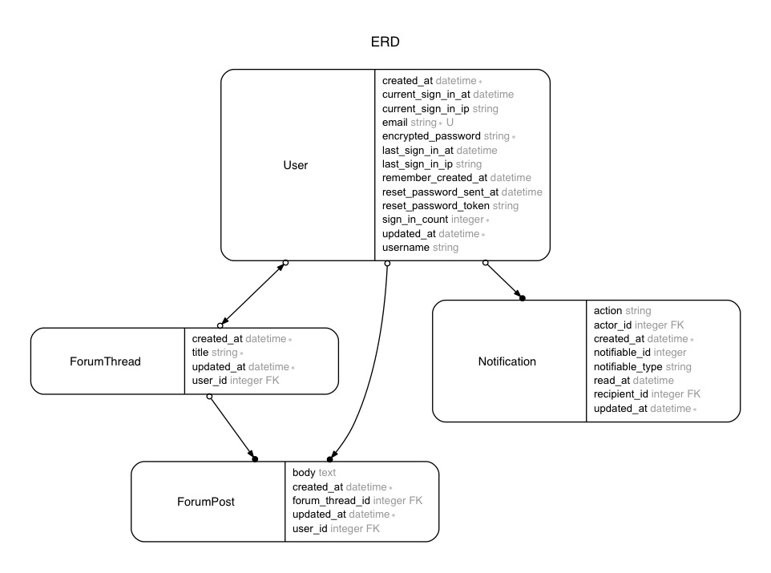

# CSV import export app

In this app, I will build the basic CSV import/export functionality in a Rails app.

- [Base app](https://github.com/mnishiguchi/notifiable_app)

---

## Dependencies
- Ruby 2.3.1
- Rails 5.0.1
- Turbolinks
- Devise
- [Bootstrap 4](https://v4-alpha.getbootstrap.com/getting-started/introduction/)
- [jch/html-pipeline](https://github.com/jch/html-pipeline) - HTML processing filters and utilities
- [NextStepWebs/simplemde-markdown-editor](https://github.com/NextStepWebs/simplemde-markdown-editor) - A simple, beautiful, and embeddable JavaScript Markdown editor
- and much more

---

## Database structure

## References

- [https://gorails.com/series/import-and-export-csv-files](https://gorails.com/series/import-and-export-csv-files)
